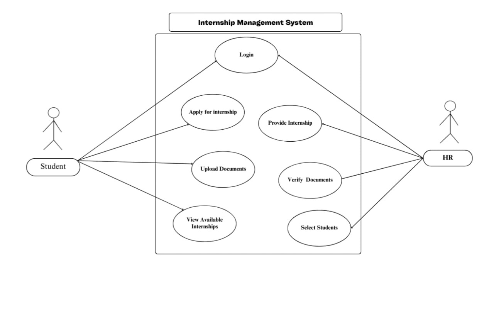
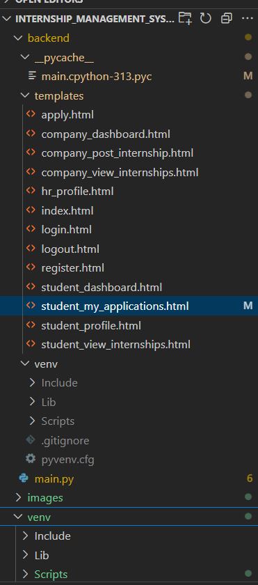
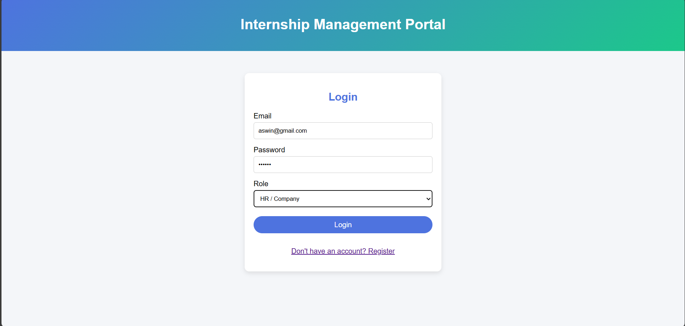
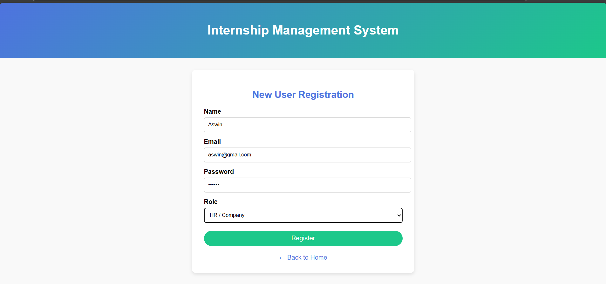
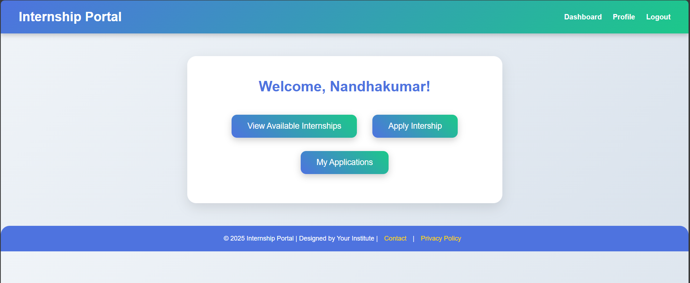
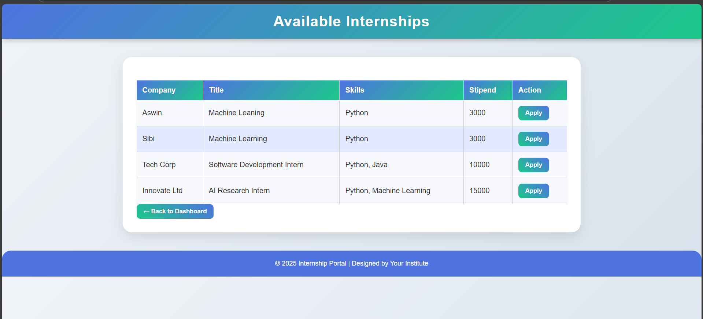
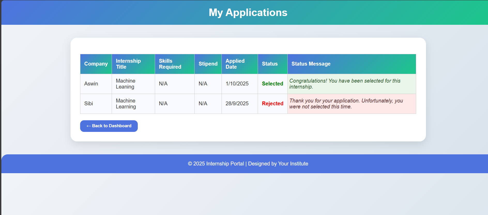
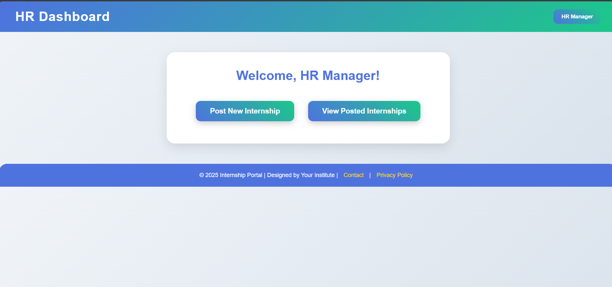
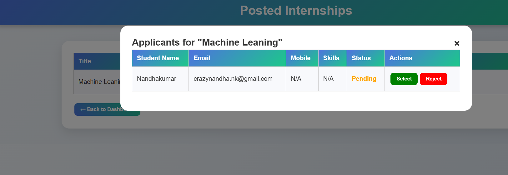

# 🎓 Internship Management System

An end-to-end **Internship Management System** developed using **FastAPI, MySQL, HTML, CSS, and JavaScript**. The platform enables students to discover and apply for internships while allowing HR/Company users to post opportunities, review applications, and manage candidates efficiently.

---

## 📌 Project Overview

The Internship Management System provides a centralized platform where:

* Students can browse and apply for internship opportunities.
* HR/Company users can create and manage internship postings.
* Companies can review applications and select or reject candidates.
* Students can track their application status in real time.
* Role-based authentication ensures secure access for different users.

---

## 🚀 Technologies Used

### Backend

* Python
* FastAPI
* MySQL
* Pydantic
* SHA-256 Password Hashing

### Frontend

* HTML5
* CSS3
* JavaScript

### Database

* MySQL

---

## ✨ Core Features

### 🔐 Role-Based Authentication

Users can register as:

* 🎓 Student
* 🏢 HR / Company

#### Security Features

* Passwords are securely hashed using SHA-256.
* Secure login authentication.
* Role-based access control.

#### Dashboard Redirection

* Students → Student Dashboard
* HR/Company Users → Company Dashboard

---

### 🎓 Student Features

#### 🔍 Browse Internships

Students can view all internship opportunities posted by companies.

#### 📝 Apply for Internships

Students can submit:

* Skills
* Experience Details
* Resume / Certificate References

#### 📊 Track Application Status

Students can monitor:

* ⏳ Pending
* ✅ Selected
* ❌ Rejected

applications directly from their dashboard.

---

### 🏢 HR / Company Features

#### 📢 Post Internship

HR users can create internship listings with:

* Internship Title
* Required Skills
* Description
* Stipend

#### 👨‍💼 Manage Applications

Companies can:

* View Applicants
* Review Skills and Resumes
* Monitor Total Applications

#### ✅ Select / Reject Candidates

HR users can update candidate status using:

* Select Button
* Reject Button

---

## 🗄️ Database Schema

### Users Table

| Field    | Description             |
| -------- | ----------------------- |
| id       | User ID                 |
| name     | User Name               |
| email    | Email Address           |
| mobile   | Mobile Number           |
| role     | Student / HR            |
| skills   | User Skills             |
| password | SHA-256 Hashed Password |

---

### Internships Table

| Field           | Description            |
| --------------- | ---------------------- |
| id              | Internship ID          |
| title           | Internship Title       |
| description     | Internship Description |
| skills_required | Required Skills        |
| stipend         | Internship Stipend     |
| company_name    | Company Name           |

---

### Applications Table

| Field         | Description                   |
| ------------- | ----------------------------- |
| id            | Application ID                |
| student_id    | Student Reference             |
| internship_id | Internship Reference          |
| skills        | Student Skills                |
| resume_link   | Resume Reference              |
| status        | Pending / Selected / Rejected |

---

## ⚙️ System Workflow

```text
Student / HR User
        │
        ▼
Frontend (HTML/CSS/JS)
        │
        ▼
JavaScript Fetch API
        │
        ▼
FastAPI Backend
        │
        ▼
Pydantic Validation
        │
        ▼
MySQL Database
        │
        ▼
JSON Response
        │
        ▼
Frontend Dashboard
```

---

## 📂 Project Directory Structure

```text
Internship_management_system1/
│
├── backend/
│   └── main.py
│
├── templates/
│   ├── index.html
│   ├── register.html
│   ├── login.html
│   ├── student_dashboard.html
│   ├── student_view_internships.html
│   ├── apply.html
│   ├── student_my_applications.html
│   ├── student_profile.html
│   ├── company_dashboard.html
│   ├── company_post_internship.html
│   ├── company_view_internships.html
│   ├── hr_profile.html
│   └── logout.html
│
├── Images/
├── Structure/
├── Use_case.jpg
├── SoftwareEngineering_Report.doc
└── README.md
```

---

## 🧩 Use Case Diagram

<p align="center">
  
</p>

---

## 🏗️ System Architecture

<p align="center">
  
</p>

---

# 📸 Application Screenshots

## 🏠 Home Page

### Front Page 1

<p align="center">
  
</p>

### Front Page 2

<p align="center">
  
</p>

---

## 🔐 Authentication Pages

### Login Page

<p align="center">
  
</p>

### Register Page

<p align="center">
  
</p>

---

## 🎓 Student Dashboard

### Student Dashboard

<p align="center">
  
</p>

### Available Internships

<p align="center">
  
</p>

### Application Status

<p align="center">
  
</p>

---

## 🏢 HR / Company Dashboard

### Company Dashboard

<p align="center">
  
</p>

### Post Internship

<p align="center">
  
</p>

### Select / Reject Candidates

<p align="center">
  
</p>

---

## ✅ Confirmation Message

<p align="center">
  
</p>

---

## 🔧 Installation & Setup

### 1. Clone Repository

```bash
git clone https://github.com/Nandhakumar1123/Internship_management_system1.git
```

### 2. Navigate to Project Directory

```bash
cd Internship_management_system1
```

### 3. Install Dependencies

```bash
pip install fastapi uvicorn mysql-connector-python
```

### 4. Configure MySQL Database

Create Database:

```sql
CREATE DATABASE internship_portal;
```

Update your database credentials inside:

```python
main.py
```

### 5. Run FastAPI Server

```bash
uvicorn main:app --reload
```

### 6. Open Browser

```text
http://127.0.0.1:8000
```

---

## 🌟 Future Enhancements

* Resume File Upload System
* Email Notifications
* Admin Panel
* AI-Based Candidate Recommendation
* Internship Search Filters
* Real-Time Chat System
* Analytics Dashboard
* Notification System

---

## 📖 Documentation

Detailed project documentation is available in:

```text
SoftwareEngineering_Report.doc
```

---

## 👨‍💻 Author

### Nandhakumar D

Full Stack Developer | FastAPI | Python | MySQL

Developed as a full-stack academic project using FastAPI and MySQL.

---

## ⭐ Support

If you found this project useful:

* ⭐ Star the Repository
* 🍴 Fork the Repository
* 📢 Share with Others

---

## 🔗 GitHub Repository

https://github.com/Nandhakumar1123/Internship_management_system1
